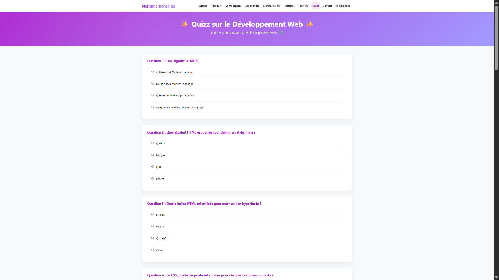

# Rapport de Projet : Site Web Personnel

**Réalisé par :** Nermine Bensalah  
**Cadre :** Cours de Programmation Web I  
**Date :** Novembre 2025

---

## 📑 Table des Matières

1. [Introduction Générale](#introduction-générale)
2. [Analyse et Objectifs](#analyse-et-objectifs)
3. [Conception et Charte Graphique](#conception-et-charte-graphique)
4. [Architecture du Projet](#architecture-du-projet)
5. [Description des Fonctionnalités](#description-des-fonctionnalités)
6. [Aperçu Visuel (Captures d'écran)](#aperçu-visuel)
7. [Choix Techniques](#choix-techniques)
8. [Conclusion](#conclusion)

---

## 1. Introduction Générale

Ce document présente le rapport de réalisation de mon site web personnel (Portfolio). Ce projet a été conçu et développé dans le cadre du module de Programmation Web I. L'objectif principal était de créer une présence en ligne professionnelle permettant de mettre en valeur mon parcours académique, mes compétences techniques, ainsi que mes expériences et passions.

Le site se veut être une vitrine interactive et dynamique, démontrant non seulement mon contenu personnel mais aussi ma maîtrise des technologies web fondamentales (HTML, CSS, JavaScript).

## 2. Analyse et Objectifs

### Objectifs Principaux
- **Présentation Personnelle :** Offrir une vue d'ensemble claire de mon profil (Bio, CV, Contact).
- **Démonstration Technique :** Prouver mes compétences en développement web à travers la réalisation même du site.
- **Interactivité :** Engager le visiteur avec des éléments dynamiques comme un quizz et des formulaires.

### Public Cible
Ce portfolio s'adresse principalement aux recruteurs, professeurs, et pairs souhaitant en savoir plus sur mon profil professionnel et académique.

## 3. Conception et Charte Graphique

Le design du site a été pensé pour être à la fois **professionnel** et **accueillant**.
- **Palette de couleurs :** Utilisation de couleurs douces et modernes pour une lecture agréable.
- **Typographie :** Choix de polices lisibles et modernes pour assurer une bonne hiérarchie visuelle.
- **Expérience Utilisateur (UX) :** Navigation intuitive via un menu fixe et une structure de page cohérente.

## 4. Architecture du Projet

L'arborescence du projet est structurée de manière logique pour faciliter la maintenance et l'évolution.

```
PROJET WEB/
│
├── index.html              # Accueil (Vitrine principale)
├── parcours.html           # Chronologie académique
├── competences.html        # Showcase technique
├── experiences.html        # Parcours professionnel
├── manifestations.html     # Vie associative et événements
├── matieres.html           # Détails du cursus
├── passions.html           # Loisirs et Soft skills
├── quizz.html              # Module interactif (JS)
├── contact.html            # Formulaire de contact
├── temoignage.html         # Retour d'expérience
│
├── css/
│   └── style.css           # Feuille de style globale
│
├── js/
│   ├── quizz.js            # Logique du quizz
│   └── contact.js          # Validation formulaire
│
└── images/                 # Ressources graphiques
    └── screenshots/        # Captures du projet
```

## 5. Description des Fonctionnalités

Le site est composé de plusieurs pages interconnectées :

- **Accueil :** Point d'entrée avec une présentation succincte et des accès rapides.
- **Parcours & Expériences :** Pages détaillées utilisant des mises en page structurées pour lister les diplômes et stages.
- **Compétences :** Utilisation de barres de progression visuelles pour indiquer le niveau de maîtrise des outils.
- **Quizz Interactif :** Une page ludique permettant de tester ses connaissances en développement web, entièrement gérée en JavaScript (calcul de score en temps réel).
- **Contact :** Formulaire fonctionnel avec validation des champs côté client.

## 6. Aperçu Visuel

Voici quelques captures d'écran illustrant le rendu final du projet sur différents terminaux.

### Vue d'ensemble
| Aperçu 1 | Aperçu 2 |
|:---:|:---:|
|  |  |

### Détails et Interactions
| Aperçu 3 | Aperçu 4 |
|:---:|:---:|
|  |  |

## 7. Choix Techniques

Pour réaliser ce projet, j'ai opté pour une approche "Vanilla" afin de maîtriser les bases avant d'utiliser des frameworks.

- **HTML5 :** Utilisation intensive des balises sémantiques (`<header>`, `<nav>`, `<section>`, `<footer>`) pour un code propre et accessible.
- **CSS3 :**
    - Utilisation de **Flexbox** et **Grid** pour les mises en page complexes.
    - **Variables CSS** (:root) pour une gestion facile des couleurs.
    - **Media Queries** pour assurer le *Responsive Design* sur mobile et tablette.
- **JavaScript (ES6) :** Manipulation du DOM pour le quizz et la validation de formulaire, sans dépendance externe (comme jQuery).

## 8. Conclusion

Ce projet m'a permis de consolider mes connaissances en développement web front-end. J'ai pu mettre en pratique les concepts théoriques vus en cours et faire face aux défis réels du développement (compatibilité, responsive design, organisation du code). Le résultat est un site fonctionnel, esthétique et évolutif qui servira de base solide pour mon futur portfolio professionnel.

---
*Généré automatiquement le 30 Novembre 2025*

